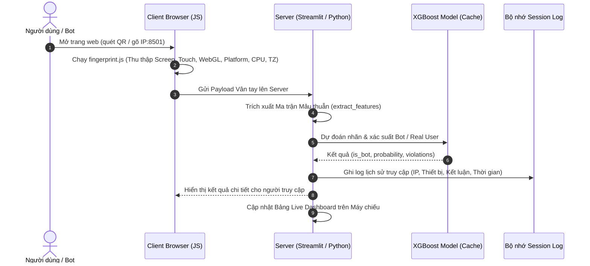

# Kế hoạch Nghiên cứu & Triển khai Giai đoạn 2 (Phase 2)
## Hệ thống Đánh giá Thực nghiệm Trực tiếp (Live Interactive Anti-detect Detection)

Dựa trên các nghiên cứu khoa học cốt lõi:
1. **FP-Inconsistent** (ACM IMC 2025): Khai thác mâu thuẫn thuộc tính không gian & thời gian.
2. **Browser Polygraph** (ACM IMC 2024): Dấu vân tay thô CGFP & kiểm tra chéo UA với API.
3. **Him of Many Faces** (NDSS 2023): Chiến lược đối nghịch của bot (Keep, Block, Mimic, Randomize).
4. **Good Bot, Bad Bot** (IEEE S&P 2021): Đặc tính lưu lượng tự động trên thực tế.

---

## 🎯 Mục tiêu & Kịch bản Trình diễn Trực tiếp (Live Demo)
1. **Thu thập Vân tay Tự động (Auto Client Fingerprinting)**:
   - Khi bất kỳ ai (bạn bè trong lớp hoặc thành viên nhóm) truy cập vào trang web, mã nguồn JavaScript ngầm sẽ tự động đọc tất cả các thông số phần cứng, hệ điều hành, màn hình, WebGL và múi giờ.
   - Hoàn toàn không cần nhập biểu mẫu thủ công.
2. **Màn hình Giám sát Trực tiếp (Live Detection Dashboard)**:
   - Hiển thị trên máy chiếu bảng lịch sử các lượt truy cập được phân loại theo thời gian thực (Real-time Live Feed).
   - Tự động phân loại:
     - **Người dùng thật (Real User)**: Điện thoại/Laptop thật của bạn bè trong lớp quét mã QR truy cập -> Hiển thị thông báo màu xanh `✅ HỢP LỆ (Real User: >98%)`.
     - **Trình duyệt Anti-detect / Bot**: Thành viên nhóm dùng trình duyệt chống phát hiện (Gologin, AdsPower, Multilogin) hoặc extension fake UA -> Hiển thị cảnh báo màu đỏ `🚨 PHÁT HIỆN ANTI-DETECT BROWSER` kèm chi tiết các trường bị lỗi mâu thuẫn (Spatial Inconsistencies).
3. **Thống kê Hiệu năng Tức thì (Live Benchmark Metrics)**:
   - Tự động tính toán tổng số lượt truy cập, Tỷ lệ nhận diện đúng người thật (True Negative Rate - TNR) và Tỷ lệ bắt dính Bot (Detection Rate / Recall).
4. **Trình chiếu Mã QR Kết nối Nhanh**:
   - Hiển thị mã QR Code chứa địa chỉ IP mạng nội bộ (LAN) để cả lớp dễ dàng quét mã truy cập bằng điện thoại.

---

## 🏗️ Kiến trúc Triển khai Kỹ thuật

---

## 🛠️ Các Bước Thực hiện (Task List)

* [x] **Bước 1**: Viết module JavaScript thu thập vân tay (User-Agent, Navigator Platform, Touch Points, Screen Resolution, WebGL Vendor/Renderer, Hardware Concurrency, Timezone).
* [x] **Bước 2**: Tích hợp cơ chế truyền nhận dữ liệu giữa Client JS và Streamlit backend.
* [x] **Bước 3**: Nâng cấp hàm trích xuất đặc trưng `extract_features` để kiểm tra thêm mâu thuẫn WebGL và mâu thuẫn thời gian.
* [x] **Bước 4**: Xây dựng giao diện **Live Dashboard**:
  * Mã QR động kèm địa chỉ LAN IP (`http://192.168.x.x:8501`).
  * Bảng Live Log cập nhật tức thì các thiết bị vừa truy cập.
  * Bảng thống kê hiệu năng (TNR, Accuracy, Recall) trực tiếp trên mẫu thực nghiệm.
* [x] **Bước 5**: Giữ nguyên tab **Manual Preset Simulator** (Giai đoạn 1) để người thuyết trình có thể chủ động demo các trường hợp lý thuyết khi cần.
